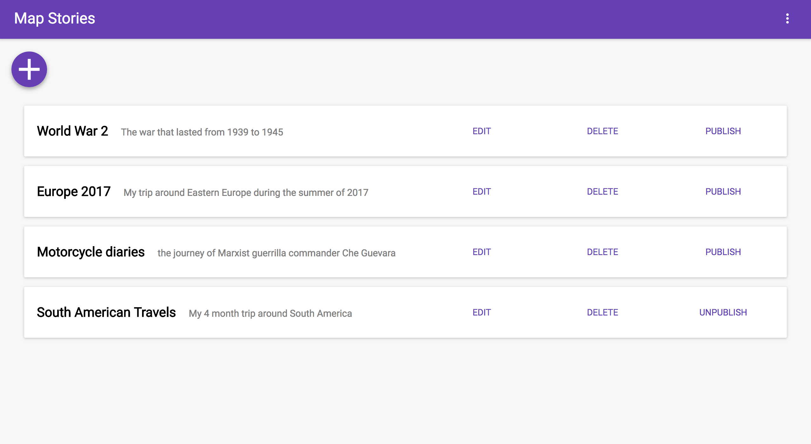

# Map-Stories-Front-End
A web app for location based storytelling using maps. View stories and create your own.

## Installation

- Fork and clone the repository
- cd into repository and run `npm install`
- Create a new Facebook app [here](https://developers.facebook.com/)
- Insert your own Facebook app ID into `appId` value in the Facebook LoginButton div in Login.js
- Run `npm start`
- Fork and clone map-stories-back-end repository [here](https://github.com/fredpinon/map-stories-back-end) and follow installation instructions

## Tech Stack

This app has been created using

- [React.js](https://reactjs.org/)
- [Redux](http://redux.js.org/)
- [MapBox](https://www.mapbox.com/api-documentation/)
- [AWS](https://aws.amazon.com/)

## Contributors

Pull requests are welcome. By participating in this project, you agree to abide by the thoughtbot code of conduct: [thoughtbot.com/open-source-code-of-conduct](https://thoughtbot.com/open-source-code-of-conduct)

Fork, then clone the repository. Push to your fork and submit a pull request.

## License

'MapStories' is licensed under the [MIT](http://www.opensource.org/licenses/mit-license.php) license.

